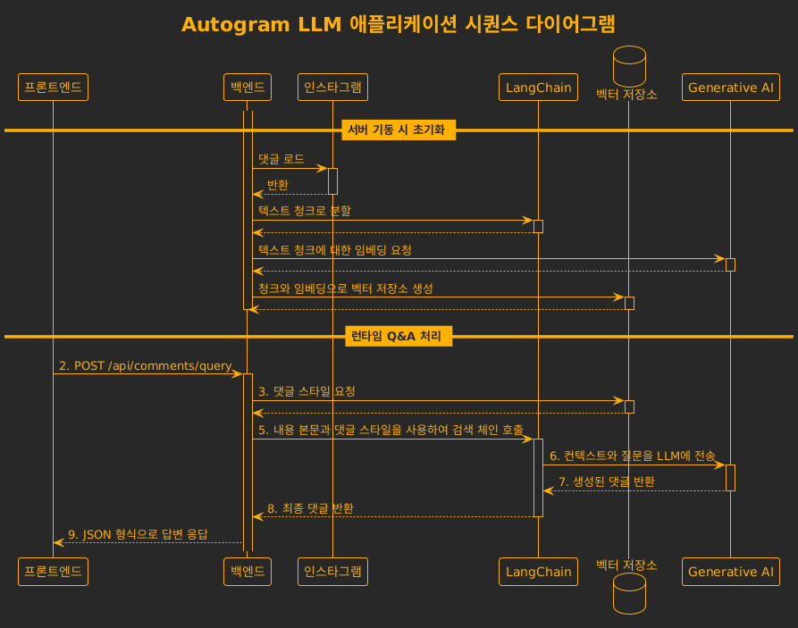

# Autogram LLM

이 프로젝트는 검색 증강 생성(Retrieval-Augmented Generation, RAG) 파이프라인을 사용하는 질의응답(QA) 시스템입니다. 인스타그램의 특정 댓글들을 검색하고, 대규모 언어 모델(LLM)을 사용하여 비슷한 스타일의 댓글을 창출합니다.

## 아키텍처


## 시퀀스 다이어그램



## 주요 기능

*   **검색 증강 생성(RAG):** RAG 파이프라인을 사용하여 인스타그램의 댓글들을 기반으로 답변을 제공합니다.
*   **FastAPI 백엔드:** 백엔드는 고성능 API를 제공하는 FastAPI로 구축되었습니다.
*   **LangChain:** LangChain은 문서 로딩, 텍스트 분할, 임베딩 및 LLM과의 상호 작용을 포함한 RAG 파이프라인을 조율하는 데 사용됩니다.
*   **Google Gemini 또는 Ollama:** 답변 생성을 위한 LLM으로 사용됩니다.
*   **FAISS:** FAISS는 벡터 임베딩의 효율적인 유사성 검색을 위해 사용됩니다.

## 시작하기

### 스펙

*   Python 3.13+
*   Instaloader

## API 엔드포인트

### `POST /api/comments/query`

*   **요청 본문:**
    ```json
    {
      "text": "댓글을 원하는 본문 내용"
    }
    ```
*   **응답 본문:**
    ```json
    {
      "answer": "생성된 댓글"
    }
    ```